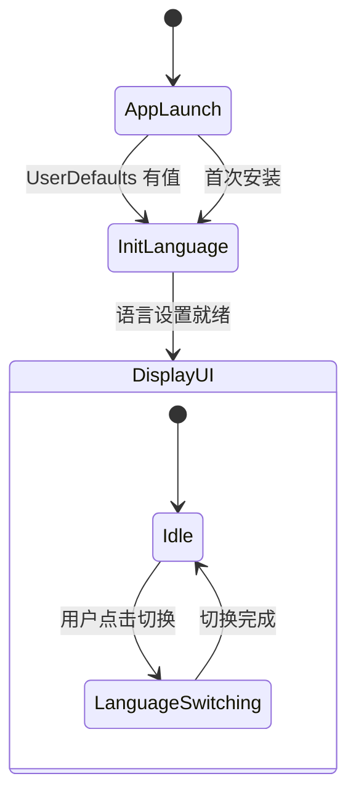

# Data Model: iOS 应用多语言支持

## Entities

### AppLanguage (枚举)

表示应用界面语言选项。

| 字段 | 类型 | 描述 |
|------|------|------|
| `rawValue` | String | 存储值: "system", "chinese", "english" |
| `displayName` | String | 显示名称（本地化） |

```swift
enum AppLanguage: String, CaseIterable, Codable {
    case system = "system"
    case chinese = "chinese"
    case english = "english"
    
    var displayName: String {
        switch self {
        case .system: return "跟随系统"
        case .chinese: return "中文简体"
        case .english: return "English"
        }
    }
    
    var displayNameEN: String {
        switch self {
        case .system: return "Follow System"
        case .chinese: return "Chinese"
        case .english: return "English"
        }
    }
}
```

### LanguageManager (服务类)

语言管理单例，负责语言设置存储和广播。

| 属性/方法 | 类型 | 描述 |
|-----------|------|------|
| `shared` | static | 单例实例 |
| `currentLanguage` | @Published AppLanguage | 当前选中的语言 |
| `switch(to:)` | Method | 切换到指定语言 |
| `getEffectiveLanguage()` | Method | 获取实际使用的语言（处理 system 情况） |
| `languageChanged` | Notification.Name | 语言变更通知 |

### LocalizedStrings (资源)

本地化字符串键值对，存储在 `.lproj/Localizable.strings` 文件中。

**按模块组织的 key 前缀**:

| 模块 | 前缀 | 说明 |
|------|------|------|
| 通用 | `common.` | 共用文本，如"确定"、"取消" |
| 录音 | `recording.` | 录音页面文本 |
| 历史 | `history.` | 历史记录页面文本 |
| 详情 | `detail.` | 转写详情页面文本 |
| 错误 | `error.` | 错误提示信息 |
| 权限 | `permission.` | 权限相关提示 |

---

## Relationships

```
LanguageManager (单例)
    ├── 依赖: UserDefaults (持久化)
    ├── 广播: NotificationCenter.languageChanged
    └── 注入: @EnvironmentObject 到所有 SwiftUI 视图
    
String.localized (扩展)
    └── 调用: LanguageManager.getEffectiveLanguage()
```

---

## State Transitions


